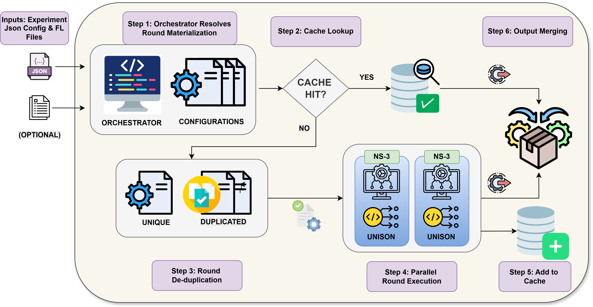

# FL-Net-Sim

FL-Net-Sim is an orchestration framework for federated learning (FL) network simulation on top of **ns-3** and **UNISON**.

Sources:
- ns-3: [repo](https://github.com/nsnam)
- UNISON: [paper](https://zenodo.org/records/10077300), [repo](https://github.com/NASA-NJU/UNISON-for-ns-3)

## Project Goals

The project has two practical goals:
- Provide a reusable, plug-and-play way to evaluate FL communication under realistic network conditions.
- Reduce simulation turnaround time without changing simulation semantics.

This is achieved through:
- **Intra-round multithreading** (UNISON) for a single ns-3 round.
- **Inter-round parallelism** in the orchestrator.
- **Deterministic caching** of equivalent effective round states.

## Supported Network Scenarios

| `network_type` | Modeled setting |
| --- | --- |
| `silo` | Cross-silo FL with wired links / datacenter-style topology |
| `wifi` | Edge and home-device scenarios over Wi-Fi |
| `lte` | Cellular / IoT-style scenarios |



## Execution Model

For each run, the orchestrator:
0. Loads a JSON config containing the expeirment configuration and optionally links to external files for integration with arbitrary FL frameworks.
1. Materializes effective round state (selection + positions) deterministically from seed and round.
2. Reuses cached round results when effective state matches a previously computed state.
3. If idnetical effective states scheduled in current run it de-duplicates to run once and link result to all equivalent rounds.
4. Executes ns-3 rounds with configured parallelism and optional UNISON settings.
5. Stores results in cache for future re-use.
6. Exports per-run and cumulative summaries.

## Deterministic Caching (High-Level)

Cache identity is two-level:
- `static_key`: identity of static network behavior.
- `round_key`: identity of effective round behavior (selected clients + realized client positions).

`round` is used to generate effective state, but is not hashed directly into `round_key`.
Equivalent effective states reuse the same cached result (unless `--force` is used).

Core cache paths:

```text
ns3/flsim_records/<static_key>/round_cache/<round_key>/{files}
ns3/flsim_records/<static_key>/round_index.csv
```

Detailed cache behavior: `cache.md`.

## Repository Layout

```text
fl-net-sim/
  assets/                        # External input examples (participation, FL stats)
  configs/                       # Scenario JSON examples
  experiments/                   # Experiment workspace (configs, runners, notebooks, outputs)
  logs/                          # Orchestrator run logs
  ns3/
    scratch/flsim/               # ns-3 FL network entrypoints
    flsim_records/               # Canonical cache records
    scripts/                     # ns-3 helper scripts
  utils/                         # Orchestrator helpers
  orchestrator.py                # Main entrypoint
  requirements.txt
  cache.md
  LICENSE
```

## Installation

### 1. Clone

```bash
git clone https://github.com/psklavos1/fl-net-sim.git
cd fl-net-sim
```

### 2. Python Environment

```bash
conda create -n netsim python=3.11 -y
conda activate netsim
pip install -r requirements.txt
```

### 3. Configure and Build ns-3

```bash
cd ns3
./scripts/configure.sh optimized
./scripts/build.sh
```

Notes:
- `./scripts/configure.sh` supports `debug` (default), `release`, and `optimized`.
- Orchestrator uses no-build mode by default; rebuild after ns-3 source changes, or run with `--build-ns3` within the orchestrator call.

## Quick Start

```bash
python orchestrator.py --config configs/wifi.json --rounds 3 --parallelism 3
```

For bundled experiment workflows, use:
- `experiments/<experiment_id>/configs/`
- `bash experiments/<experiment_id>/run_experiment.sh`
- `experiments/<experiment_id>/*postprocess*.ipynb`

## Orchestrator CLI

### Core Flags

| Flag | Purpose |
| --- | --- |
| `--config <path>` | Config JSON path |
| `--rounds <N \| A..B>` | Round count or inclusive range |
| `--parallelism <k>` | Max concurrent rounds |
| `--force` | Re-run even if cache exists |
| `--dry-run` | Plan execution without running ns-3 |
| `--no-mtp` | Disable UNISON multithreading (`wifi`/`silo`) |
| `--mtp-threads <N>` | Enable UNISON with fixed thread count (`wifi`/`silo`) |
| `--build-ns3` | Build ns-3 before execution |
| `--merge-stats <csv-or-dir>` | Merge external FL stats by `round` |
| `--list-records` | List compact cache record summary |
| `--cleanup-logs` / `--cleanup-records` / `--cleanup` | Cleanup logs and/or cache records |

### Command Examples

```bash
# Basic run
python orchestrator.py --config configs/wifi.json --rounds 5

# Inclusive range + parallelism
python orchestrator.py --config configs/lte.json --rounds 3..5 --parallelism 4

# Dry-run planning
python orchestrator.py --config configs/silo.json --rounds 1..10 --dry-run

# Force rerun
python orchestrator.py --config configs/wifi.json --rounds 3 --force

# UNISON control
python orchestrator.py --config configs/wifi.json --rounds 1 --no-mtp
python orchestrator.py --config configs/silo.json --rounds 1 --mtp-threads 4

# External FL stats merge
python orchestrator.py --config configs/lte.json --merge-stats assets/fl-results.csv
python orchestrator.py --config configs/lte.json --merge-stats assets/fl-results

# Records/log management
python orchestrator.py --list-records
python orchestrator.py --cleanup-logs
python orchestrator.py --cleanup-records
python orchestrator.py --cleanup
```

## Configuration Overview

Each run is defined by a single JSON file.

### Minimal Structure

```json
{
  "network_type": "wifi",
  "description": "example_wifi_run",
  "reproducibility": {
    "seed": 1
  },
  "sim": {},
  "presets": {},
  "network": {},
  "fl_traffic": {
    "transport": "tcp",
    "model_size_mb": 10
  },
  "metrics": {},
  "orchestration": {
    "rounds": 5,
    "parallelism": 4,
    "force": false,
    "participation": {
      "file": null,
      "selection_pct": 0.4
    },
    "positioning": {
      "mode": "explicit",
      "std_m": 0.0
    },
    "unison": {
      "enabled": true,
      "threads": null
    }
  },
  "lte": {}
}
```

### Top-Level Field Categories

| Field | Role |
| --- | --- |
| `network_type` | Selects scenario family: `silo`, `wifi`, or `lte`. |
| `description` | Human-readable run label. |
| `reproducibility` | Seeds and deterministic controls for repeatable runs. |
| `sim` | Simulation-level timing/window controls. |
| `presets` | Reusable performance/profile definitions used by scenario entities. |
| `network` | Topology and node/link/client placement configuration. |
| `fl_traffic` | FL communication model (transport, payload/traffic behavior). |
| `metrics` | Output collection toggles (for example flow monitor/event logs). |
| `orchestration` | Orchestrator policy (`rounds`, `parallelism`, participation, positioning, UNISON); stripped before ns-3 execution. |
| `lte` | LTE-specific runtime knobs; relevant for `network_type=lte`. |

## External FL Integration

External input examples are in `assets/`:
- `assets/participation.csv`
- `assets/fl-results.csv`
- `assets/fl-results/*.csv`

`--merge-stats` behavior (short):
- Merge key is `round`.
- Single file: merged directly by `round`.
- Directory: per-file CSVs are combined by `round` (numeric columns averaged).
- Compute-related totals are exported when compute columns are available (`training_time_s`, `compute_time_s`, `computation_time_s`).

## Outputs

Direct orchestrator runs write to:
- `logs/<run_id>/requested_rounds.csv`
- `logs/<run_id>/requested_rounds.json`
- `logs/<run_id>/rounds/<network_type>_round_<round>.log`
- `ns3/flsim_records/<static_key>/all_rounds.csv`
- `ns3/flsim_records/<static_key>/all_rounds.json`


## Experiments

Current bundled experiments:
- `exp1_presets`
- `exp2_parallelism_ablation`
- `exp3_redundancy_elimination`
- `exp4_scalability_clients`

See `experiments/README.md` and each experiment README for setup and outputs.

## License

Apache License 2.0. See `LICENSE`.
